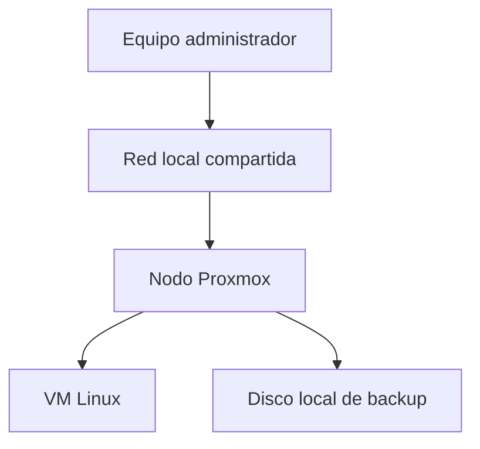
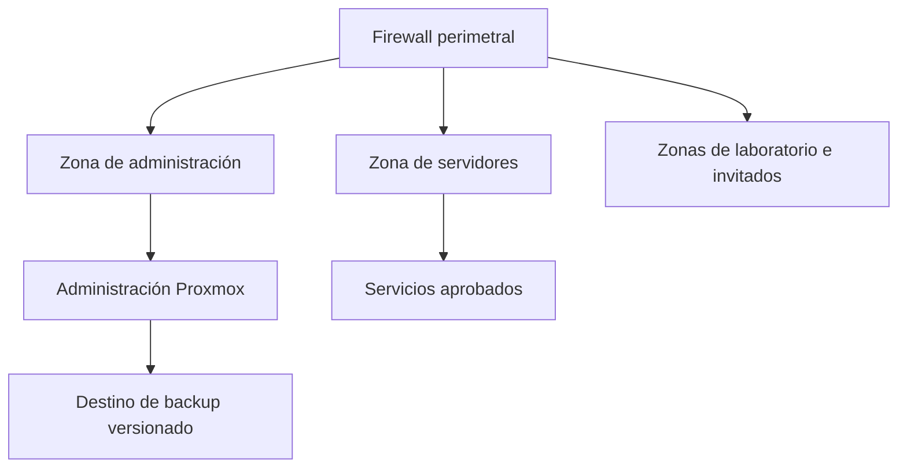

# Homelab seguro

[English version](README.md)

Evaluación de seguridad basada en evidencia y hoja de ruta de endurecimiento para un entorno Proxmox con características similares a la infraestructura de una pequeña empresa.

Este repositorio demuestra cómo inventariar infraestructura, distinguir hechos comprobados de suposiciones, documentar riesgos y convertir hallazgos en un plan ejecutable. Es un caso de estudio sanitizado para portafolio: no contiene configuraciones reales ni afirma que todos los controles objetivo estén implementados.

## Objetivo

El proyecto sigue un método sencillo y profesional:

1. Recopilar evidencia de solo lectura.
2. Eliminar información sensible e identificadores.
3. Documentar fortalezas y brechas sin exageraciones.
4. Priorizar correcciones según riesgo e impacto operativo.
5. Definir criterios de aceptación antes de cambiar el sistema.
6. Volver a comprobar y actualizar la evidencia.

## Estado verificado

Fecha de verificación: **20 de agosto de 2026**.

| Área | Hallazgo sanitizado | Estado |
|---|---|---|
| Plataforma | Un nodo Proxmox VE 9.x | Verificado |
| Capacidad | 4 núcleos físicos, 8 hilos y aproximadamente 46 GiB de memoria utilizable | Verificado |
| Almacenamiento | SSD de aproximadamente 1 TB con LVM/LVM-thin y HDD local separado para backups | Verificado |
| Redundancia | No se detectó ZFS ni RAID por software | Brecha verificada |
| Cargas | Una VM Linux configurada y ningún contenedor LXC | Verificado |
| Red | Administración y VM comparten un bridge sin VLAN en la capa del hipervisor | Brecha verificada |
| Recuperación | 32 archivos, aproximadamente 133 GiB; sin tarea automática ni restauración documentada | Parcial |
| Firewall, SSH y monitoreo | Requieren una revisión independiente | No verificado |

## Arquitectura actual

## Arquitectura objetivo

La arquitectura objetivo incorpora separación de confianza, reglas de mínimo privilegio, acceso administrativo monitoreado, backups programados y pruebas periódicas de restauración. Está claramente marcada como plan futuro.

## Prioridades

1. Programar backups con retención y alertas.
2. Ejecutar una restauración aislada y documentar el resultado.
3. Verificar acceso administrativo, actualizaciones y firewall efectivo.
4. Separar tráfico de administración y cargas de trabajo.
5. Incorporar monitoreo de salud, capacidad y seguridad.
6. Mantener una copia de recuperación independiente o externa.

## Contenido

- [Evaluación y evidencia](docs/assessment.md)
- [Arquitectura y modelo de amenazas](docs/architecture.md)
- [Hoja de ruta](docs/hardening-roadmap.md)
- [Plan de backup y restauración](docs/recovery-runbook.md)
- [Mapeo NIST CSF 2.0](docs/nist-csf-2.0-mapping.md)
- [Metodología de verificación](docs/methodology.md)
- [Colector Proxmox de solo lectura](scripts/collect-proxmox-inventory.sh)

## Principios de publicación

- No se publican direcciones, MAC, seriales, hostnames, usuarios, tokens ni configuraciones reales.
- Un snapshot no se considera un backup independiente.
- Un archivo de backup no se considera válido hasta completar una restauración.
- Todo control planificado se diferencia visualmente de uno verificado.
- El mapeo con NIST ayuda a organizar el trabajo; no representa una certificación.

Consulta [SECURITY.md](SECURITY.md) antes de reportar un problema. El proyecto utiliza la [Licencia MIT](LICENSE).
