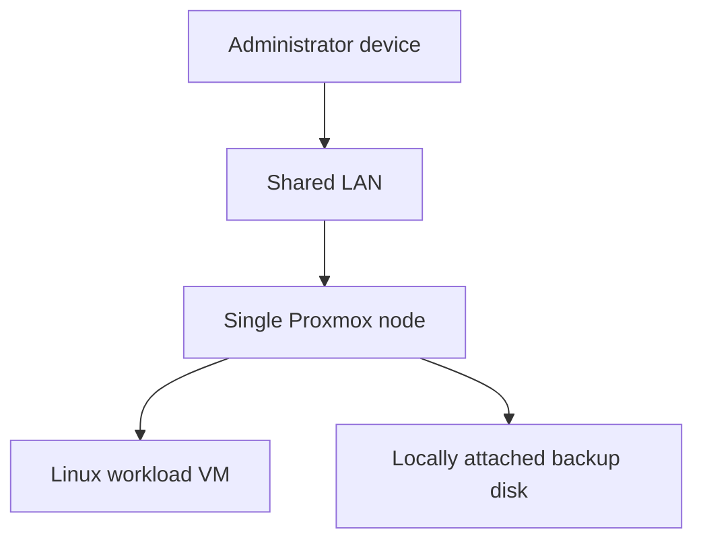
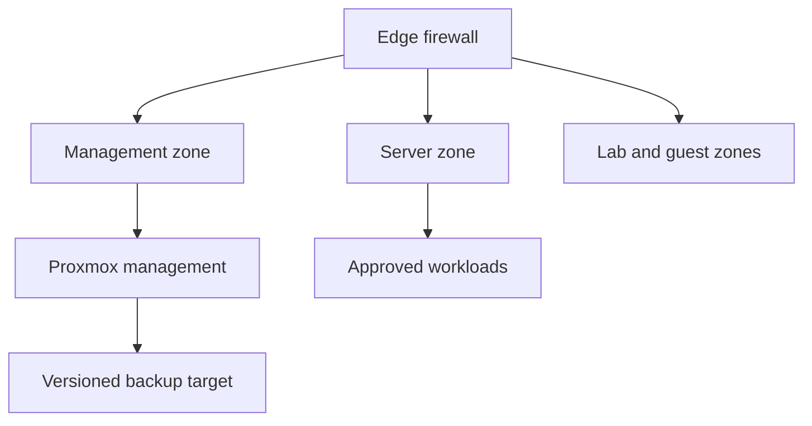

# Secure Homelab

[Versión en español](README.es.md)

An evidence-backed security assessment and hardening roadmap for a small-business-style Proxmox environment.

This repository shows how I inventory infrastructure, separate verified facts from assumptions, document risk, and turn findings into an actionable security program. It is a sanitized portfolio case study—not a production configuration dump and not a claim that every target control is already implemented.

## Why this project exists

Small organizations often inherit infrastructure that works but lacks current documentation, tested recovery, network separation, and measurable security controls. This project applies a practical consulting workflow:

1. Collect read-only evidence.
2. Remove identifying and sensitive data.
3. Record current strengths and gaps honestly.
4. Prioritize remediation by business impact.
5. Define acceptance criteria before making changes.
6. Retest and update the evidence register.

## Current-state snapshot

Verified on **2026-08-20**. Public details are intentionally generalized.

| Area | Sanitized finding | Status |
|---|---|---|
| Platform | Single-node Proxmox VE 9.x environment | Verified |
| Compute | 4 physical cores / 8 threads and approximately 46 GiB usable memory | Verified |
| Primary storage | Approximately 1 TB SSD using LVM and LVM-thin | Verified |
| Recovery storage | Separate approximately 1 TB local HDD | Verified |
| Disk redundancy | No ZFS pool or Linux software RAID detected | Verified gap |
| Workloads | One configured Linux VM; no LXC containers | Verified |
| VM baseline | UEFI, Q35, VirtIO storage/network, guest-agent configuration, 4 vCPU, 12 GiB RAM and 100 GiB disk | Verified |
| Network | Management and workload share one untagged bridge at the hypervisor layer | Verified gap |
| Backup archives | 32 archives totaling approximately 133 GiB were present | Verified |
| Backup automation | No scheduled Proxmox backup job was configured | Verified gap |
| Restore validation | No documented restore test | Not verified |
| Firewall, SSH and monitoring | Require a separate control review | Not verified |

The full, sanitized evidence register is in [docs/assessment.md](docs/assessment.md).

## Architecture

### Observed state



The diagram deliberately excludes real addresses, hostnames, interface names, hardware identifiers, and service endpoints.

### Target state



The target adds explicit trust boundaries, least-privilege rules, monitored administrative access, scheduled backups, and recurring restore tests. It is a roadmap, not a representation of the current deployment.

## Priority findings

### Strengths

- Dedicated virtualization platform with a small, understandable workload inventory.
- Modern virtual hardware baseline using UEFI, Q35 and VirtIO.
- Separate physical backup destination instead of storing every copy in the VM disk.
- Existing snapshots and backup archives provide historical recovery material.
- Evidence collection is read-only and removes common infrastructure identifiers.

### Highest-priority gaps

1. Establish automated backups with retention and alerting.
2. Prove recovery through an isolated restore drill.
3. Verify administrative access, patch status and effective firewall policy.
4. Separate management and workload traffic.
5. Add health, capacity and security monitoring.
6. Add an independent or off-site recovery copy.

See [docs/hardening-roadmap.md](docs/hardening-roadmap.md) for acceptance criteria.

## Repository map

| Path | Purpose |
|---|---|
| [docs/assessment.md](docs/assessment.md) | Evidence register and current findings |
| [docs/architecture.md](docs/architecture.md) | Current and target architecture, trust boundaries and threat model |
| [docs/hardening-roadmap.md](docs/hardening-roadmap.md) | Risk-based remediation phases and success criteria |
| [docs/recovery-runbook.md](docs/recovery-runbook.md) | Safe backup and isolated restore-test procedure |
| [docs/nist-csf-2.0-mapping.md](docs/nist-csf-2.0-mapping.md) | High-level mapping to NIST CSF 2.0 |
| [docs/methodology.md](docs/methodology.md) | Evidence, sanitization and publication method |
| [scripts/collect-proxmox-inventory.sh](scripts/collect-proxmox-inventory.sh) | Sanitized, read-only Proxmox inventory collector |
| [examples/sanitized-inventory.example.md](examples/sanitized-inventory.example.md) | Fictitious example report |

## Safe inventory collection

Review the script before running it:

```bash
less scripts/collect-proxmox-inventory.sh
```

Run it locally on an authorized Proxmox host:

```bash
sudo bash scripts/collect-proxmox-inventory.sh \
  --output /tmp/proxmox-inventory.md
```

The collector does not install packages, restart services, change configuration, or read credential files. It creates one report with mode `0600` and excludes names, addresses, MACs, serials, VM identifiers, storage names, tokens, private keys, and environment secrets.

Always review generated output manually before sharing it.

## Evidence status model

| Status | Meaning |
|---|---|
| Verified | Direct command output or functional evidence was observed on the stated date |
| Verified gap | Direct evidence confirms the control is absent or insufficient |
| Partial | Some elements exist, but the control is not complete or tested |
| Not verified | No current evidence supports a public claim |
| Planned | Target design or future work; not implemented |

## Scope and limitations

- This is a single-node lab reference, not a high-availability design.
- No real client, home, or workshop topology is published.
- Configuration examples are generalized and must be adapted and tested.
- A snapshot is not treated as an independent backup.
- Backup files are not considered valid until a restore succeeds.
- NIST CSF mapping provides organization, not certification or compliance.

## Security and license

Do not submit real credentials, addresses, hostnames, configuration exports, or customer data. Read [SECURITY.md](SECURITY.md) before reporting a security issue.

Released under the [MIT License](LICENSE).
