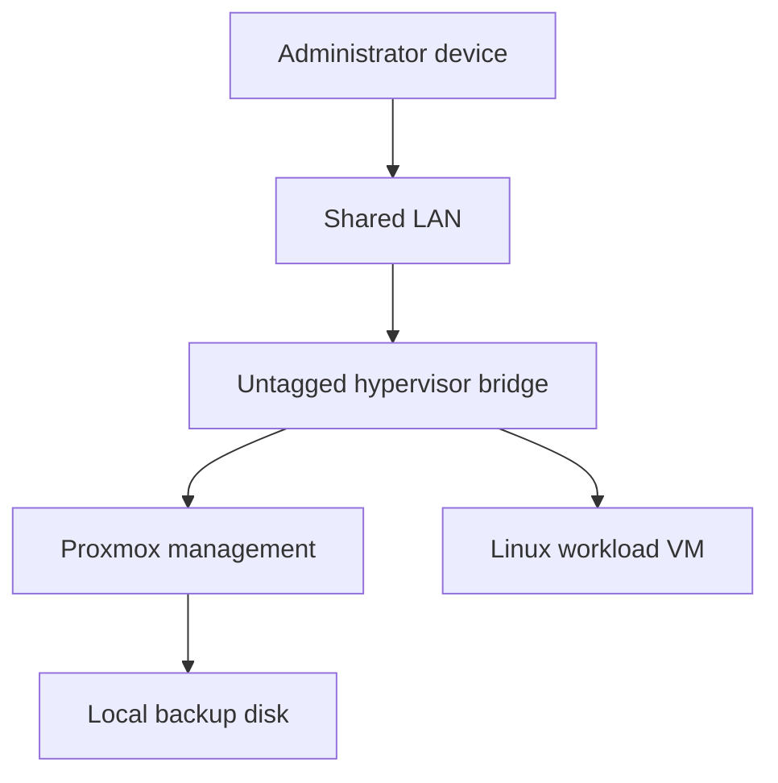
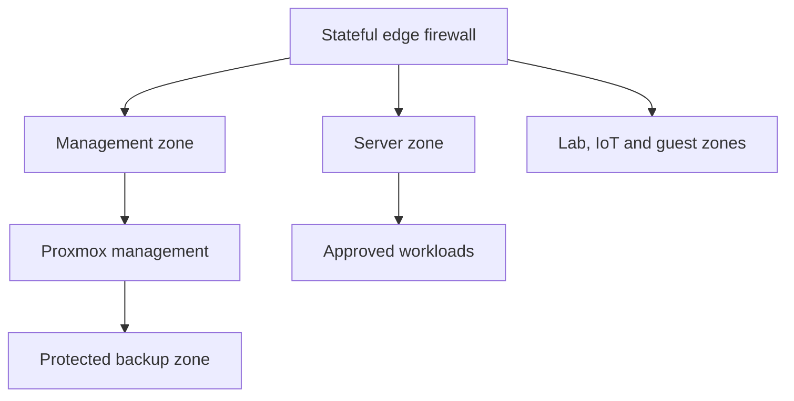

# Architecture and threat model

## Scope boundary

The public architecture is intentionally functional rather than literal. Names, addresses, vendors, interface identifiers, and service endpoints are removed. Only evidence needed to explain security decisions is retained.

## Observed architecture

### Observed trust properties

- The hypervisor management plane and workload share a Layer 2 segment.
- One physical interface carries the active bridge.
- No hypervisor-level VLAN-aware setting or VM VLAN tag was observed.
- Backup storage is physically separate from the primary SSD but remains attached to the same node.
- The environment has one node, so compute availability depends on that host.

## Target architecture

### Target trust properties

- Administrative access originates only from approved management devices or VPN identities.
- Hypervisor management is not reachable from guest, IoT, or general client networks.
- Workloads receive explicit VLAN placement and least-privilege east-west rules.
- Backup administration and data paths are restricted separately from workload traffic.
- Security and availability events generate alerts with an accountable owner.
- An additional recovery copy is independent of the hypervisor and local backup disk.

## Primary assets

| Asset | Security objective |
|---|---|
| Hypervisor management plane | Prevent unauthorized control of every hosted workload |
| VM data and configuration | Preserve confidentiality, integrity and recoverability |
| Backup archives | Prevent deletion, corruption and untested recovery assumptions |
| Administrative credentials | Limit privilege and resist credential theft |
| Network policy | Enforce trust boundaries and reduce lateral movement |
| Evidence and documentation | Remain accurate without exposing exploitable details |

## Threat model

| Threat scenario | Potential impact | Current observation | Target control |
|---|---|---|---|
| Compromised LAN device reaches management services | Hypervisor takeover and workload compromise | Shared untagged segment | Dedicated management zone, VPN, allowlist and MFA where supported |
| Workload compromise enables lateral movement | Access to management or other future services | No demonstrated workload segmentation | VLAN placement and deny-by-default inter-zone rules |
| Primary disk or host fails | Workload outage and possible data loss | Single node and no disk redundancy | Tested backups, independent copy and documented rebuild procedure |
| Ransomware or operator error affects local copies | Backups deleted or encrypted with production | Backup disk attached to same node | Separate credentials, immutability/off-site copy and recovery drills |
| Stale backup creates false confidence | Recovery point misses required data | Latest archive exceeded 90 days | Scheduled jobs, retention, alerting and RPO reporting |
| Weak or unknown admin authentication | Unauthorized privileged access | SSH controls not yet verified | Individual keys, disabled direct root login, MFA/VPN and access review |
| Misconfiguration during hardening | Management lockout or service outage | Change process not yet defined | Backup first, staged changes, console access and rollback criteria |
| Public portfolio leaks real infrastructure details | Targeting or credential exposure | Publication is being sanitized | Redaction, secret scanning and owner review before release |

## Design principles

1. **Recoverability before complexity.** A tested recovery path precedes major network or access changes.
2. **Management is a separate trust zone.** Hypervisor access is not ordinary LAN access.
3. **Default deny across zones.** Each allowed flow requires a documented business purpose.
4. **Least privilege for people and services.** Shared admin accounts and broad persistent access are avoided.
5. **Evidence over assumption.** Configuration flags are paired with functional tests.
6. **Safe failure.** Every change includes console access, a rollback point and a stop condition.
7. **No sensitive topology in public artifacts.** Examples use invented labels and reserved documentation values.

## Constraints

- The current environment is a single-node lab with limited physical network interfaces.
- High availability requires additional hardware and is outside the initial scope.
- The target diagram is technology-neutral; specific firewall, switch and monitoring products will be selected only after requirements and compatibility are confirmed.
