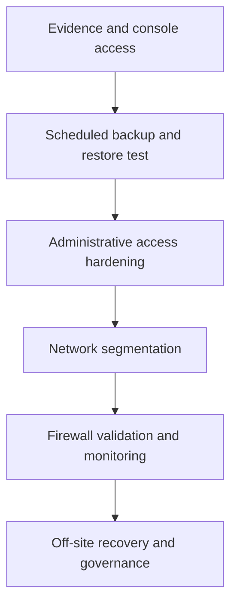

# Risk-based hardening roadmap

## Purpose

This roadmap converts the assessment into bounded, testable improvements. Every item below is a **planned control** until its acceptance criteria are met and the evidence register is updated.

No production-changing command is included in this public document. Exact implementation steps belong in a private change record after backups, compatibility, console access, and rollback are confirmed.

## Priority model

| Priority | Meaning |
|---|---|
| P0 | Recovery or access prerequisite; complete before other material changes |
| P1 | High-value reduction of security or availability risk |
| P2 | Important operational maturity improvement |
| P3 | Optimization after core controls are reliable |

## Phase 0 — Establish change safety

**Priority:** P0

### Actions

- Record the current platform, storage, workload and network state.
- Confirm local console access before modifying remote access or networking.
- Define a maintenance window, owner, rollback point and stop conditions.
- Export or record the minimum private configuration required for reconstruction.
- Protect the private evidence separately from this public repository.

### Acceptance criteria

- Current inventory is dated and reviewed.
- A named owner approves the change window.
- Console access is tested.
- Rollback steps are written before implementation begins.

## Phase 1 — Make recovery credible

**Priority:** P0

### Actions

- Create scheduled VM backups with documented retention.
- Configure failure notifications.
- Perform a restore into an isolated network with a non-conflicting identity.
- Record recovery point, elapsed recovery time and validation results.
- Add an independent copy that is not continuously writable by the hypervisor.

### Acceptance criteria

- Scheduled jobs complete successfully for two consecutive cycles.
- A failed-job alert reaches the responsible person.
- Restored VM boots in isolation without affecting the original.
- Required files or services pass a documented validation checklist.
- Measured RPO and RTO are recorded.

## Phase 2 — Verify and harden administrative access

**Priority:** P1

### Actions

- Inventory effective SSH, web UI and local-console authentication paths.
- Create individual administrative identities.
- Deploy and test public-key authentication before disabling password access.
- Disable direct remote root login after an alternate privileged path succeeds.
- Restrict management access to an approved zone or VPN.
- Review session timeout, audit logs and account-removal procedures.

### Acceptance criteria

- Two tested recovery-capable admin paths exist.
- Password-only and shared privileged access are removed where operationally safe.
- A non-approved network cannot reach the management plane.
- Successful and failed administrative logins are visible in retained logs.

## Phase 3 — Introduce network trust boundaries

**Priority:** P1

### Actions

- Define Management, Server, Lab, IoT and Guest zones by function.
- Confirm switch, firewall and interface VLAN compatibility.
- Prepare an out-of-band or console rollback method.
- Enable VLAN handling in a staged maintenance window.
- Move one low-risk test workload before migrating other services.
- Document every allowed inter-zone flow and its business owner.

### Acceptance criteria

- Management is reachable only from authorized sources.
- Guest and IoT zones cannot initiate connections to management.
- Server access is limited to documented ports and sources.
- DNS, DHCP, time synchronization and required application paths pass testing.
- A rollback exercise or tabletop review succeeds.

## Phase 4 — Enforce policy and add visibility

**Priority:** P1

### Actions

- Enable firewall processing at every required policy layer.
- Apply deny-by-default inbound and inter-zone policies.
- Add health checks for hypervisor, storage, backups and critical workloads.
- Alert on failed backups, low storage, stopped required services and repeated login failures.
- Centralize or forward security-relevant logs with defined retention.

### Acceptance criteria

- Traffic tests prove required flows succeed and prohibited flows fail.
- Firewall policy is reviewed without exposing it publicly.
- A simulated backup failure and service failure both generate alerts.
- Alert ownership, response time and escalation path are documented.

## Phase 5 — Improve resilience and governance

**Priority:** P2

### Actions

- Add an off-site or offline recovery copy.
- Define patch and vulnerability-review cadence.
- Establish configuration review and approval records.
- Run quarterly restore drills and annual disaster-recovery exercises.
- Reassess whether a second node or dedicated backup server is justified.
- Update the NIST CSF mapping after each completed phase.

### Acceptance criteria

- Recovery copies span more than one failure domain.
- Patch, backup, access and restore evidence is reviewed on schedule.
- Exceptions have an owner, reason, expiration date and compensating control.
- Documentation reflects tested state rather than intended state.

## Recommended sequence

The sequence matters: network and access changes can cause lockout, so recovery and console access come first.
