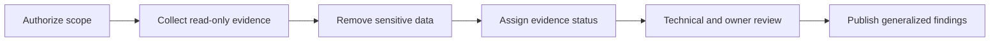

# Evidence and sanitization methodology

## Operating rule

No control is presented as implemented unless current evidence supports it. Recommendations, historical records and live verification are kept separate.

## Workflow



## Evidence hierarchy

| Level | Evidence type | Permitted conclusion |
|---|---|---|
| A | Current command output plus functional test | Verified current control |
| B | Current read-only configuration output | Verified configuration; effectiveness may still need testing |
| C | Dated historical report or screenshot | Verified historical state only |
| D | User recollection or design note | Recorded or planned; no implementation claim |

## Collection safeguards

- Use read-only commands and APIs.
- Do not install packages, restart services, start workloads, or change settings during inventory.
- Whitelist required output instead of copying complete configuration files.
- Do not read environment files, private keys, tokens, passwords, browser data, or credential stores.
- Store raw internal evidence privately with restrictive permissions.
- Stop if a command exposes more data than the assessment requires.

## Public redaction rules

The public repository must not contain:

- real IP addresses, MAC addresses or hostnames;
- usernames, email addresses, domains or external endpoints;
- disk serials, hardware asset tags or unique IDs;
- VM/container IDs and internal workload names;
- tokens, passwords, API keys, cookies, certificates or private keys;
- complete firewall, DNS, VPN, SSH or network configuration exports;
- customer, employee or business operational data;
- screenshots with browser profiles, tabs, notifications or hidden metadata.

Public examples use invented role names and reserved documentation values. Identifiers are removed rather than partially masked when correlation could reveal the original environment.

## Claim rules

- An enabled feature flag does not prove an effective policy.
- A running process does not prove secure configuration.
- A snapshot does not equal an independent backup.
- A backup archive does not prove recoverability.
- A successful local request does not prove safe public exposure.
- A target diagram is always labeled as planned.
- Conflicting evidence remains unresolved until a new authoritative check is performed.

## Script review

The inventory collector is designed to:

- write only one explicitly selected report file;
- refuse to overwrite an existing report;
- create the report with permissions `0600`;
- summarize counts and capacity without object names;
- redact common IPv4, MAC and email patterns;
- exclude hostnames, VM IDs/names, storage names and serials;
- avoid files commonly used for secrets.

Before execution:

```bash
bash -n scripts/collect-proxmox-inventory.sh
```

After execution, a human must inspect the report before sharing it. Automated redaction reduces risk but cannot understand every custom identifier.

## Publication gates

| Gate | Required result |
|---|---|
| Scope | Environment and authorized actions are explicit |
| Evidence | Every current-state claim has a dated source |
| Truthfulness | Planned, partial and verified controls are distinguishable |
| Privacy | No real infrastructure or personal identifiers remain |
| Secret review | Common credential patterns and private-key headers are absent |
| Technical review | Commands, diagrams, links and conclusions are consistent |
| Owner review | Repository owner approves the exact public content |
